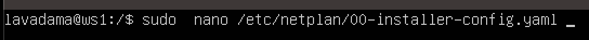
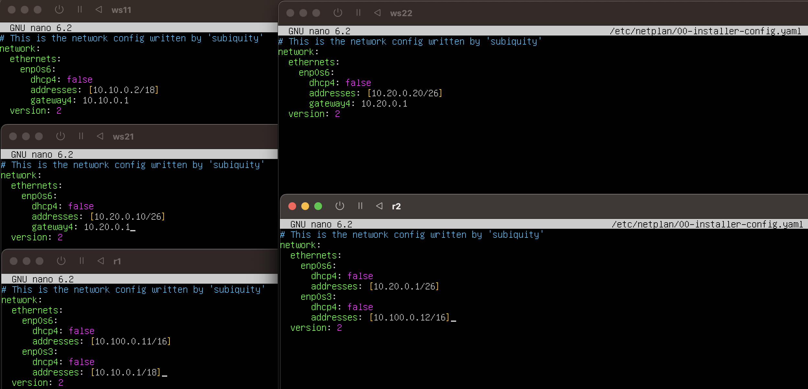
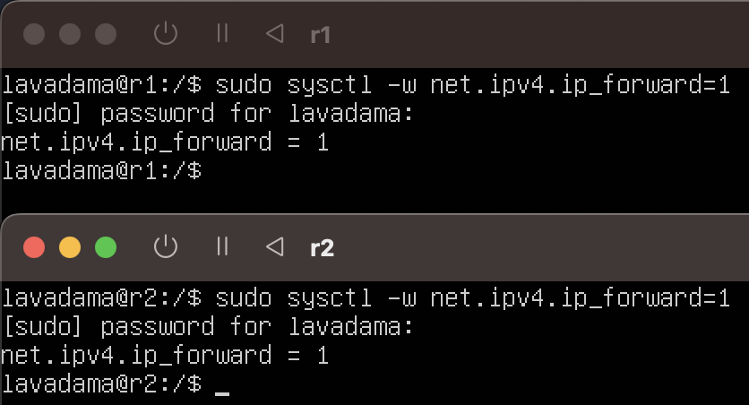
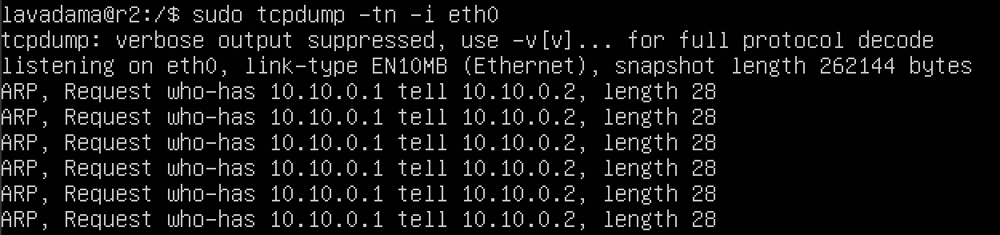
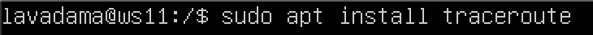

## Part 1. Инструмент **ipcalc**
### 1.1. Сети и маски
Aдрес сети 192.167.38.54/13 определяем с помощью команды ipcalc.

Перевод маски 255.255.255.0 в префиксную и двоичную запись:

Перевод маски /15 в обычную и двоичную:

Перевод маски 11111111.11111111.11111111.11110000 в обычную и префиксную:

Минимальный и максимальный хост в сети 12.167.38.4 при масках: /8, 11111111.11111111.00000000.00000000, 255.255.254.0 и /4:

### 1.2. localhost
localhost (так называемый, «местный» от англ. local, или «локальный хост», по смыслу — этот компьютер) — в компьютерных сетях, стандартное, официально зарезервированное доменное имя для частных IP-адресов (в диапазоне 127.0.0.1 — 127.255.255.254, RFC 2606). Для сети, состоящей только из одного компьютера, как правило, используется всего один адрес — 127.0.0.1, который устанавливается на специальный сетевой интерфейс «внутренней петли» (англ. loopback) в сетевом протоколе TCP/IP.

Loopback — это термин, который обычно используется для описания методов или процедур маршрутизации электронных сигналов, цифровых потоков данных, или других движущихся сущностей от их источника и обратно к тому же источнику без специальной обработки или модификаций. Первоначально он использовался для тестирования передачи или передающей инфраструктуры.

### 1.3. Диапазоны и сегменты сетей
Публичным IP-адресом называется IP-адрес, под которым вас видят устройства в интернете, и он является уникальным во всей сети интернет. Доступ к устройству с публичным IP-адресом можно получить из любой точки глобальной сети.

Частный IP-адрес (англ. private IP address), также называемый внутренним, внутрисетевым или локальным — IP-адрес, принадлежащий к специальному диапазону, не используемому в сети Интернет. Такие адреса предназначены для применения в локальных сетях, распределение таких адресов никем не контролируется.

К приватным адресам относятся IP-адреса, значения которых лежат в следующих диапазонах: 
10.0.0.0 – 10.255.255.255 (10.0.0.0\8)
172.16.0.0 – 172.31.255.255 (172.16.0.0\12)
192.168.0.0 – 192.168.255.255 (192.168.0.0\16).
127.0.0.0 — 127.255.255.255 (Зарезервировано для петлевых интерфейсов (не используется для связи между узлами сети), так называемый localhost)

Все остальные IP относятся к публичным.

Приватные ip адресса: 10.0.0.45, 10.10.10.10, 172.20.250.4, 172.16.255.255, 192.168.4.2

Публичные ip адресса: 134.43.0.2, 172.0.2.1, 192.169.168.1, 172.68.0.2, 192.172.0.1

Шлюз (Gateway) – это сетевое устройство, предназначенное для объединения двух сетей (передачи между ними пользовательского трафика), которые обладают различными характеристиками, используют различные протоколы или технологии.

Возможные IP адреса шлюза у сети 10.10.0.0/18: 10.10.0.2, 10.10.10.10, 10.10.1.255

## Part 2. Статическая маршрутизация между двумя машинами
Вывод информации о сетевых интерфейсах с помощью команды ip a с машины ws1 и ws2:

Зададаем следующие адреса и маски: ws1 - 192.168.100.10, маска /16, ws2 - 172.24.116.8, маска /12:

после применения сети:

### 2.1. Добавление статического маршрута вручную
Добавляем статический маршрут от одной машины до другой и обратно при помощи команды вида ip r add:

Пропинговываем соединение между машинами:

### 2.2. Добавление статического маршрута с сохранением
Перезагружаем машины с помощью команды reboot.
Добавляем статический маршрут от одной машины до другой с помощью файла etc/netplan/00-installer-config.yaml

Принимаем изменение командой sudo netplan apply

Пропинговываем соединение между машинами:

## Part 3. Утилита **iperf3**
iperf3 — это программа для измерения пропускной способности сети в режиме реального времени. Это один из мощных инструментов для тестирования максимально достижимой пропускной способности в IP-сетях (поддерживает IPv4 и IPv6).
### 3.1. Скорость соединения
Базовой единицей скорости передачи информации является бит в секунду (бит/с).
Разница между байтами в секунду (Б/с) и битами в секунду такая же, как разница между байтами и битами: 1 Б/с = 8 бит/с.
Точно так же разница между килобайтами в секунду (КБ/с) и Б/с такая же, как разница между килобайтами и байтами: 1 КБ/с = 1024 Б/с. И так далее.

8Mbps -> 1MB/s
100MB/s -> 819200Kbps
1Gbps -> 1024Mbps

### 3.2. Утилита iperf3
Чтобы проверить пропускную способность сети, вам нужно сначала подключиться к удаленной машине, которую вы будете использовать в качестве сервера, и запустить iperf3 в режиме сервера, используя флаг -s, по умолчанию он будет прослушивать порт 5201.

Вы можете указать формат (k, m, g для кбит, мегабит, гигабит или K, M, G для килобайт, мегабайт, гигабайт) для отчета, используя переключатель -f, как показано. iperf3 -s -f К
При желании вы можете запустить сервер в качестве демона, используя флаг -D, и записывать сообщения сервера в файл журнала следующим образом. iperf3 -s -D > iperf3log

Затем на вашем локальном компьютере, который мы будем рассматривать как клиент (где происходит фактический бенчмаркинг), запустите iperf3 в режиме клиента, используя флаг -c, и укажите хост, на котором работает сервер (используя либо его IP-адрес, либо домен, либо имя хоста). iperf3 -c 192.168.10.1 -f К

Измеряем скорость соединения между ws1 и ws2:

На сервере $ iperf3 -s:
На клиенте $ iperf3 -c 192.168.100.10 -p 5201:

Важно: по результатам тестов, как показано на снимке экрана выше, есть различия в значениях сервера и клиента. Но вы всегда должны использовать результаты, полученные с клиентского компьютера iperf3, в каждом тесте, который вы выполняете.

## Part 4. Сетевой экран
### 4.1. Утилита iptables
iptables — это утилита брандмауэра командной строки, которая использует цепочки политик для разрешения или блокировки трафика. Когда соединение пытается установиться в вашей системе, iptables ищет правило в своем списке, чтобы сопоставить его. Если он не находит его, он прибегает к действию по умолчанию.

Создаем файл /etc/firewall.sh, имитирующий фаерволл, на ws1 и ws2:

Добавляем в файл подряд следующие правила:
1) на ws1 применить стратегию когда в начале пишется запрещающее правило, а в конце пишется разрешающее правило (это касается пунктов 4 и 5)
2) на ws2 применить стратегию когда в начале пишется разрешающее правило, а в конце пишется запрещающее правило (это касается пунктов 4 и 5)
3) открыть на машинах доступ для порта 22 (ssh) и порта 80 (http)
4) запретить echo reply (машина не должна "пинговаться”, т.е. должна быть блокировка на OUTPUT)
5) разрешить echo reply (машина должна "пинговаться")

Запускаем файлы на обеих машинах командами sudo chmod +x /etc/firewall.sh и /etc/firewall.sh

Разница между стратегиями - будет выполнено первое подходящее правило. Правила, которые применяются после, будут игнорироваться.

#### 4.2. Утилита nmap
Командой ping находим машину, которая не "пингуется", после чего утилитой nmap показаваем, что хост машины запущен:

Устанавливаем nmap - sudo apt install nmap

Одной из особенностей nmap является то, что эта утилита может определить, включен ли хост, даже если его нельзя пропинговать.

Сохраняем дампы образов виртуальных машин

## Part 5. Статическая маршрутизация сети
### 5.1. Настройка адресов машин
Поднять пять виртуальных машин (3 рабочие станции (ws11, ws21, ws22) и 2 роутера (r1, r2))

Переименование имени хоста для каждой машины:

Настроить конфигурации машин в etc/netplan/00-installer-config.yaml согласно сети на рисунке.

Перезапускаем сервис сети:

Командой ip -4 a проверяем, что адрес машины задан верно:

Пропинговать ws22 с ws21:

Пропинговать r1 с ws11:

### 5.2. Включение переадресации IP-адресов.
Для включения переадресации IP, выполните команду на роутерах:

При таком подходе переадресация не будет работать после перезагрузки системы.

Откройте файл /etc/sysctl.conf и добавьте в него следующую строку:

При использовании этого подхода, IP-переадресация включена на постоянной основе.

### 5.3. Установка маршрута по-умолчанию
Настроить маршрут по-умолчанию (шлюз) для рабочих станций. Для этого добавить default перед IP роутера в файле конфигураций

После изменения настроек применяем команду для вступления в силу изменений

Вызовем ip r, чтобы показать, что маршрут добавился в таблицу маршрутизации

Пропингуем с ws11 роутер r2, пинг не пройдёт, т.к. роутер "не знает" куда вернуть ответ, при этом передача пакетов с машины осуществляется.

Чтобы посмотреть какие девайсы можно прослушать

tcpdump -D

Запускаем на r2 утилиту tcpdump, она позволяет прослушать порты и вывести на экран информацию с каких IP адресов приходят пакеты. В данном случае слушаем интерфейс eth0

tcpdump -tn -i eth0
Сначала на экране r2 будет пусто, идёт ожидание входящих пакетов

Запускаем ping на ws11 ping -c 5 10.100.0.12

### 5.4. Добавление статических маршрутов
Добавить в роутеры r1 и r2 статические маршруты в файле конфигураций.

Для вступления изменений в силу воспользуемся командой 

10.20.0.0/26 через 10.100.0.12 устройство enp0s8

10.10.0.0/18 через 10.100.0.11 устройство enp0s3

Для адреса 10.10.0.0/18 был выбран маршрут, отличный от 0.0.0.0/0 (он попадает под маршрут по-умолчанию), т.к. машина ws11 соединена с сетью 10.10.0.0/18 по своему IP-адресу 10.10.0.2, для других адресов используется маршрут по умолчанию, который указан в файле 10.10.0.1.

### 5.5. Построение списка маршрутизаторов

Для установки утилиты на ws11 используем команду
sudo apt install traceroute

Запустим на r1 команду дампа
tcpdump -tnv -i eth0

-n - не конвертировать адреса в имена;
-t - не выводить время при выводе каждой строкчи дампа;
-v - при синтаксическом анализе и выводить более подробную информацию. Например, печатаются время создания, общая длина и параметры IP-пакета. Также включает дополнительные проверки целостности пакетов, такие как проверка контрольной суммы заголовка IP и ICMP.

При помощи утилиты traceroute построим список маршрутизаторов на пути от ws11 до ws21.

Каждый пакет проходит на своем пути определенное количество узлов, пока достигнет своей цели. Причем, каждый пакет имеет свое время жизни. Это количество узлов, которые может пройти пакет перед тем, как он будет уничтожен. Этот параметр записывается в заголовке TTL, каждый маршрутизатор, через который будет проходить пакет уменьшает его на единицу. При TTL=0 пакет уничтожается, а отправителю отсылается сообщение Time Exceeded.

Команда traceroute linux использует UDP пакеты. Она отправляет пакет с TTL=1 и смотрит адрес ответившего узла, дальше TTL=2, TTL=3 и так пока не достигнет цели. Каждый раз отправляется по три пакета и для каждого из них измеряется время прохождения. Пакет отправляется на случайный порт, который, скорее всего, не занят. Когда утилита traceroute получает сообщение от целевого узла о том, что порт недоступен трассировка считается завершенной.

### 5.6. Использование протокола ICMP при маршрутизации

Запустим на r1 перехват сетевого трафика, проходящего через enp0s8 с помощью команды

sudo tcpdump -n -i enp0s8 icmp

Пропингуем с ws11 несуществующий IP (например, 10.30.0.111) с помощью команды

Сохраняем дампы образов виртуальных машин

## Part 6. Динамическая настройка IP с помощью **DHCP**

Если утилита isc-dhcp-server ещё не установлена, то файла /etc/dhcp/dhcpd.conf ещё не существует в нужном виде. Соответственно для работы с протоколом DHCP сначала надо установить эту утилиту

Для r2 настроить в файле /etc/dhcp/dhcpd.conf конфигурацию службы DHCP

1) указать адрес маршрутизатора по-умолчанию, DNS-сервер и адрес внутренней сети.
Открываем файл /etc/dhcp/dhcpd.conf для редактирования

2. в файле /etc/resolv.conf(содержит адреса серверов имен, к которым имеет доступ данная система) прописываем nameserver 8.8.8.8

Перезагрузим службу DHCP

Можно проверить статус службы

Изменим настройки машин ws21 и ws22 в файле конфигурации, чтобы сделать протокол DHCP активным. На каждой машине введём

Перезагружаем виртуальную машину ws21

Проверяем присвоенный устройствам адрес

Проверим соединение машины ws22 с ws21

Указать MAC адрес у ws11, для этого в etc/netplan/00-installer-config.yaml надо добавить строки: macaddress: 10:10:10:10:10:BA, dhcp4: true

Выключаем машину ws11

Заходим в менеджер виртуальных машин VirtualBox и там настраиваем ws11 MAC-адрес

Для r1 настроим аналогично r2, но выдачу адресов сделаем с жесткой привязкой к MAC-адресу (ws11).

sudo nano /etc/resolv.conf

systemctl restart isc-dhcp-server

Проводим аналогичные тесты - смотрим какой адрес назначен машине ws11
ip a

Пропингуем соединение
ping -c 5 10.10.0.4

Обновление ip адреса с помощью команды sudo dhclient.
Проверяем IP до обновления

Запросим с ws21 обновление ip адреса с помощью команды

sudo dhclient -v

-v - будет выведена дополнительная информация.

ip a

Чтобы обновить или освободить IP-адрес для конкретного интерфейса, например, eth0, необходимо ввести:

sudo dhclient -r eth0
sudo dhclient eth0

В части 6 были использованы следующие опции DHCP протокола:

option routers ip-address [, ip-address...]; - адреса шлюзов для клиентской сети. Маршрутизаторы должны быть перечислены в порядке предпочтительности.
option domain-name-servers ip-address [, ip-address...]; - Список DNS серверов доступных клиенту. Сервера должны быть перечислены в порядке предпочтительности.

Сохраняем дампы образов виртуальных машин.

## Part 7. **NAT**
Для работы с сервером apache2, установим его на машины r1, r2 и ws22. Возможно apache2 не будет устанавливаться, тогда возможно поможет обновление системы (см. ниже).

sudo apt install apache2

Обновление системы

sudo apt update

sudo apt upgrade -y

-y - при запросе сразу согласиться с установкой.

7.1 Делаем сервер Apache2 общедоступным.

В файле /etc/apache2/ports.conf на ws22 и r1 меняем строку Listen 80 на Listen 0.0.0.0:80.

sudo nano /etc/apache2/ports.conf

Вызов команды service apache2 start на машинах ws22 и r1

Статус можно проверить командой 
sudo systemctl status apache2

7.2 Создаем фаервол на r2 (как в части 4). Следующие правила:

1) Удаление правил в таблице filter - iptables -F

2) Удаление правил в таблице "NAT" - iptables -F -t nat

3) Отбрасывать все маршрутизируемые пакеты - iptables --policy FORWARD DROP

Запустим файлы на обеих машинах командами:

sudo chmod +x /etc/firewall.sh

sudo bash /etc/firewall.sh

При запуске файла firewall.sh с этими правилами, ws22 не должна "пинговаться" с r1.

Проверяем соединение между r1 и ws22

ping -c 5 10.20.0.20

4) Разрешить маршрутизацию всех пакетов протокола ICMP, для этого прописываем правило для протокола icmp и цепочки FORWARD

sudo nano /etc/apache2/ports.conf

sudo bash /etc/firewall.sh

Теперь при запуске файла firewall.sh с этими правилами, ws22 должна "пинговаться" с r1

Проверяем соединение между r1 и ws22

ping -c 5 10.20.0.20

 
5) Включаем SNAT, а именно маскирование всех локальных ip из локальной сети, находящейся за r2 (по обозначениям из Части 5 - сеть 10.20.0.0)

6) Включаем DNAT на 8080 порт машины r2 и добавим к веб-серверу Apache, запущенному на ws22, доступ извне сети

sudo nano /etc/apache2/ports.conf

`DNAT` — подменяет адрес получателя в заголовке IP-пакета, основное применение — предоставление доступа к сервисам снаружи, находящимся внутри сети;

`SNAT` — служит для преобразования сетевых адресов, применимо, когда за сервером находятся машины, которым необходимо предоставить доступ в Интернет, при этом от провайдера имеется статический IP-адрес.

Значения использованных опций:

t - указывает на используемую таблицу;

p - указывает протокол, такие как tcp, udp, udplite и другие, поддерживаемые системой, ознакомиться со списком можно в файле /etc/protocols;

m - подключает указанный модуль;

s - указывает адрес источника пакета, в качестве значения можно указать как один IP-адрес, так и диапазон;

i - задает входящий сетевой интерфейс;

o - указывает исходящий сетевой интерфейс;
--dport - порт получателя пакета;

Проверяем соединение по TCP для SNAT, для этого с ws22 подключаемся к серверу Apache на r1 командой telnet [адрес] [порт]

telnet 10.100.0.11 80

Проверяем соединение по TCP для DNAT, для этого с r1 подключаемся к серверу Apache на ws22 (обращаться по адресу r2 и порту 8080)

telnet 10.100.0.12 8080

Сохраняем дампы образов виртуальных машин.

## Part 8. Дополнительно. Знакомство с **SSH Tunnels**

Запустим на r2 фаервол с правилами из Части 7

Запустим веб-сервер Apache на ws22 только на `localhost` (то есть в файле `/etc/apache2/ports.conf` изменим строку `Listen 80` на `Listen localhost:80`)

Переадресация локального порта позволяет перенаправить порт на локальном компьютере (клиент ssh) на порт на удаленном компьютере (сервер ssh), который затем перенаправляется на порт на компьютере назначения. В этом типе переадресации клиент SSH прослушивает заданный порт и туннелирует любое подключение к этому порту к указанному порту на удаленном сервере SSH, который затем подключается к порту на целевом компьютере. Конечным компьютером может быть удаленный SSH-сервер или любой другой компьютер.

Устанавливаем соединение с сервером ws22 от машины ws21

`ssh -L 8080:localhost:80 10.20.0.20`

Воспользуемся `Remote TCP forwarding` c ws11 до ws22, чтобы получить доступ к веб-серверу на ws22 с ws11

Переадресация удаленного порта противоположна переадресации локального порта. Это позволяет перенаправить порт на удалённом компьютере (сервер ssh) на порт на локальном компьютере (клиент ssh), который затем перенаправляется на порт на компьютере назначения. В этом типе переадресации сервер SSH прослушивает заданный порт и туннелирует любое соединение с этим портом на указанный порт локального клиента SSH, который затем подключается к порту на целевом компьютере. Машина назначения может быть локальной или любой другой машиной. Удаленное перенаправление портов в основном используется для предоставления доступа к внутренней службе кому-то извне.

Для проверки, сработало ли подключение в обоих предыдущих пунктах, перейдите во второй терминал (например, клавишами Alt + F2) и выполните команду:
`telnet 127.0.0.1 [локальный порт]`

ws11:

ws21:

Сохраняем дампы образов виртуальных машин.
